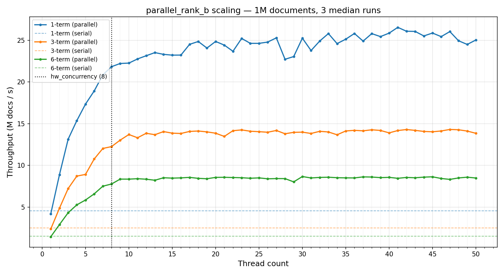

# Search Ranker

A C++ document ranking system built on a custom thread pool. The ranker scores candidate documents across 23 weighted signals and returns the top-K results. Three ranking modes are provided: a single-threaded baseline and two parallel variants that demonstrate the allocation cost of per-document heap vectors.

Throughput across all three query complexities at 8 threads:

| Query complexity | Serial | 8 threads | Speedup |
| :---: | :---: | :---: | :---: |
| 1 term | 4.5M docs/s | 21.8M docs/s | **4.8×** |
| 3 terms | 2.5M docs/s | 12.3M docs/s | **4.9×** |
| 6 terms | 1.5M docs/s | 7.8M docs/s | **5.2×** |



---

## Redacted Files

`ranking_detail.h` and `ranker_weights.h` are redacted at the request of the course to prevent copying, as the entire system was submitted for a class project. Ranking and Strategy files are modified/improved, while the following are omitted:

- **Ranker weights** — weight-loading function and scoring coefficients (`ranker_weights.h`)
- **Exact phrase match algorithm** (`ranking_detail.h`)
- **Term ordering score algorithm** (`ranking_detail.h`)
- **Term coverage algorithm** (`ranking_detail.h`)
- **Early term match score algorithm** (`ranking_detail.h`)

---

## Architecture

### Thread Pool

`ThreadPool` is a standard fixed-size worker pool backed by a `std::queue` of `std::function<void()>` tasks. Workers block on a `std::condition_variable` and wake when work is available. An atomic counter tracks in-flight tasks so that `wait()` blocks the caller until the queue drains completely.

```
enqueue(task) → push to queue, notify one worker
wait()        → block until active_tasks == 0 and queue is empty
```

### Ranker

The ranker implements a weighted, additive scoring model using the [Strategy pattern](https://en.wikipedia.org/wiki/Strategy_pattern). Each `Strategy` subclass computes a normalized score in `[0.0, 1.0]` for a single signal. The final document score is:

```
score(doc) = Σ weight_i × strategy_i.Score(doc)
```

Strategies are registered once at startup via `AddStrategy`. Three strategies are query-dependent (`UrlTermPresenceStrat`, `UrlTermProximityStrat`, `ExactTitleMatch`) and update their internal state through `SetQuery` — all others are stateless and need no per-query work. Each call to `ScoreDetailed` returns both the combined score and the per-strategy breakdown, stored on each `RankedResult` for inspection.

Results are maintained in a min-heap of size K (default 10). A document is only inserted if its score exceeds the current minimum, keeping memory and merge cost proportional to K rather than the full corpus size.

---

## Ranking Signals

The 23 strategies are organized into four groups:

### Document Quality

| Strategy | Description |
| :--- | :--- |
| `DomainStrat` | Scores by TLD tier — academic, government, and non-profit domains rank highest |
| `ShortURLStrat` | Prefers shorter URLs, penalizing very long ones |
| `ShortTitleStrat` | Prefers concise page titles, penalizing overly long ones |
| `OutlinkCount` | Rewards pages that link out to many other pages using a logarithmic scale |
| `UrlDepth` | Prefers pages reachable in fewer crawl hops from the seed |
| `SeedDomainDepth` | Prefers pages reachable with fewer domain switches from the seed |
| `UrlPathDepth` | Prefers pages with shallow URL paths |
| `QueryParamPenalty` | Penalizes URLs containing a search query parameter, indicating a search-within-search page |

### Query–URL Match

| Strategy | Description |
| :--- | :--- |
| `UrlTermPresenceStrat` | Scores by how many query terms appear anywhere in the URL |
| `UrlTermProximityStrat` | Scores by how compactly and in-order query terms appear within the URL |

### Content Signals (Body / Title / Anchor)

Each of the four algorithms below is applied independently to three text fields, yielding 12 strategies total.

| Algorithm | Description |
| :--- | :--- |
| **Exact phrase** | Rewards documents where all query terms appear consecutively in the correct order |
| **Term ordering** | Rewards documents where query terms appear in the same relative order as the query |
| **Early match** | Rewards documents where query terms appear near the beginning of the content |
| **Term coverage** | Rewards documents where more of the distinct query terms are present in the field |

### Composite

| Strategy | Description |
| :--- | :--- |
| `ExactTitleMatch` | Rewards pages whose title consists of exactly the query terms |

---

## Parallel Ranking

The document corpus is split into chunks of 500 docs. Each chunk is submitted as a task to the thread pool. Workers maintain a **local** min-heap of size K and only acquire the global mutex once per chunk to merge their local results into the shared top-K heap. This keeps lock contention proportional to the number of chunks, not the number of documents.

| Method | Allocation | Notes |
| :--- | :--- | :--- |
| `parallel_rank_a` | One `vector<double>` **per document** | Fresh allocation on every `ScoreDetailed` call |
| `parallel_rank_b` | One `vector<double>` **per chunk**, reused | Allocated once with `reserve`, cleared and reused across all 500 docs in the chunk; copy on insert rather than move |

`parallel_rank_b` avoids ~499 redundant heap allocations per chunk, which accounts for most of its speedup over `parallel_rank_a`.

---

## Performance Benchmarks

All results use `parallel_rank_b` on 1,000,000 documents (3-term query, 3 run median, Apple M-series 8-core).

| Threads | Throughput | Speedup vs serial |
| :---: | :---: | :---: |
| serial | 2.5M docs/s | 1.0× |
| 1 | 2.4M docs/s | 0.96× |
| 4 | 8.9M docs/s | 3.6× |
| 8 | 12.3M docs/s | **4.9×** |
| 16 | 13.8M docs/s | 5.5× |
| 32 | 14.1M docs/s | 5.6× |
| 50 | 13.9M docs/s | 5.6× |

Scaling plateaus around hardware concurrency (8 threads). Beyond that, throughput stays flat because threads context switch on the same cores. The gap between `parallel_rank_a` and `parallel_rank_b` is due almost entirely to eliminated per-document heap allocations inside each chunk.
